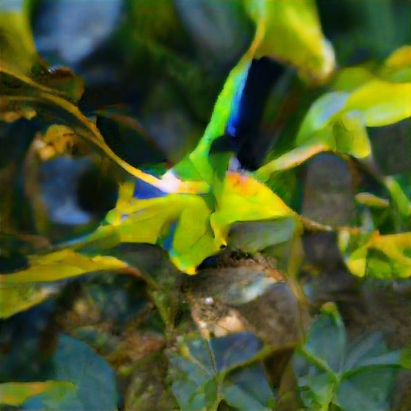

# text-to-image

Girilen Türkçe metni İngilizce'ye çevirip metinle ilgili yapay zekaya dayalı bir ekran görüntüsü veren proje.
Projede Nvidia'nın CUDA teknolojisini kullandım. Projenin build etmesi biraz uzun sürüyor.
Bütün çıktılar klasörde oluşturuluyor, en son halini oluşturunca proje sonlanıyor.

Girdi "denizin içinde ağaç" verince çıktıların ilk ve son halleri aşağıdaki şekildedir->

